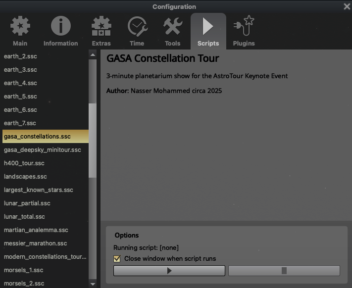

# Stellarium script for UofT GASA AstroTours

Version: Stellarium 25.3
Download [here](https://stellarium.org/)

This repository has the scripts used for the UofT GASA AstroTours planetarium show. 

Outline for the planetarium guide is found in `guide_script.md`

## Script Installation

After installing Stellarium, navigate to `/Users/{USER}/Library/Application Support/Stellarium/scripts` (create the scripts directory if it doesn't already exist) and copy the `.ssc` files into it.

## Barebones instruction
To run the scrips in Stellarium, use the hotkey Fn2 to bring up the configuration menu.

Navigate to "Scripts"

and find the relevant script. Hit 'play' to begin the planetarium show.

My scripts include pauses that require input from the user to move on to the next object/scene. Currently, when input is required an ellipsis will appear in the top-left of your screen. Press '-' or '=' to proceed. 

## Tips and Tricks

The best way to get familiar with navigation in Stellarium is to just play around, here are the main things I've found useful.

### Hotkeys
`Cmd + F`: Brings up the object search menu. During one of the ellipsis pauses you are free to pan, navigate to new object, and change the FOV without interupting the script; useful if you want to freestyle.

`C`: Toggles constellation lines.

`D`: Toggles deep-sky object labels.

`E`: Toggles equitorial coordinate system overlay.

`Fn2`: Brings up configuration menue.

`Fn1`: Brings up 'Help' menu (inclides hotkey details)

`Fn12`: Brings up Stellarium console + logs

